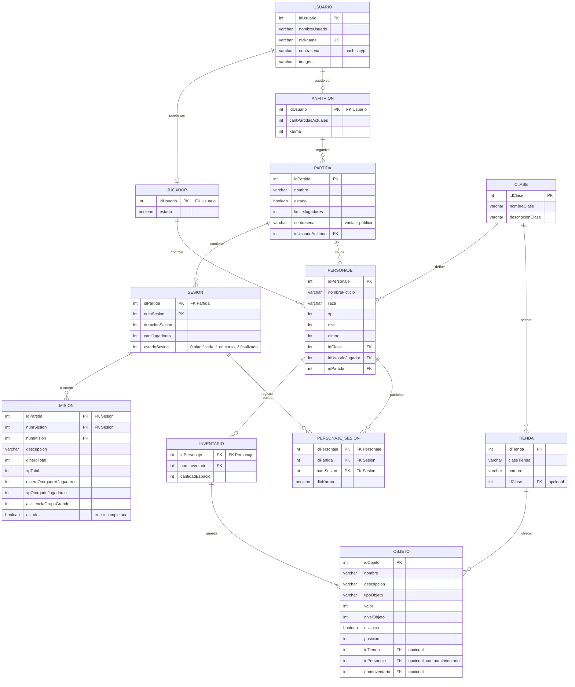

# Modelo de datos vigente

Esta página reemplaza a `ModeloDominioOLD.drawio.png`, que quedó desactualizado: no incluye
`esUnico` en Objeto ni refleja los nombres de campos que finalmente se implementaron. El diagrama
`DER_NEW.png` sigue siendo válido como vista general; lo de abajo es la versión que se corresponde
exactamente con `src/entities/` y con `SQL/rpg.sql`.

## Diagrama entidad-relación



## Reglas que no se ven en el diagrama

- Un `Usuario` puede tener los dos perfiles a la vez, uno solo o ninguno; el registro crea el primero
  y la pantalla «Mis perfiles» permite sumar el otro.
- Un `Objeto` está en una tienda **o** en un inventario, nunca en los dos: al comprarlo se mueve la
  referencia dentro de la misma transacción.
- `posicion` es la ranura dentro del inventario y no puede repetirse en el mismo inventario.
- `karma` sube o baja con las calificaciones de los participantes; `cantPartidasActuales` se calcula
  contando las partidas activas del anfitrión, no se guarda a mano.
- Las claves compuestas (`Sesion`, `Mision`, `Inventario`, `PersonajeSesion`) se fijan al crear el
  registro y no se modifican al editar: viajan en la URL.

## Correspondencia con el SQL

`SQL/rpg.sql` crea estas mismas tablas. Para ver el SQL que MikroORM generaría a partir de las
entidades y compararlo con ese archivo (no se conecta a la base):

```bash
npm run schema:dump
```
